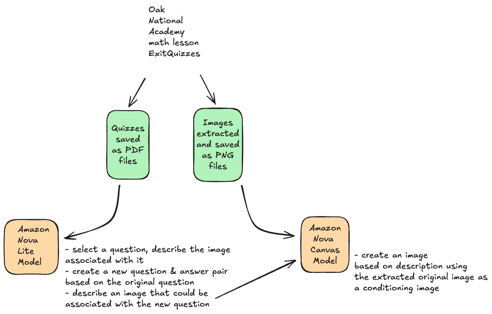

# Oak Bedrock Content Gen

The idea of this project is to use material from Oak National Academy's open API to create revision content by utilizing two
Amazon Bedrock Nova models as described in the below diagram.

The material contains exit quizzes for maths lessons based on UK curriculum. These exit quizzes containt questions and answers
and most of the exercises contain also an image that pupils can use to work through the question. The quizzes will be
processed in two steps - Nova Lite model will first extract the questions, describe images and based on those details
create a new similar question - answer pair and image description. Nova Canvas will then be used to create an image based
on the description using the original image as a 'conditioning image'. 

Further details about the experimental project is available in this [blog article](https://blog.marikabergman.com/maths-revision-material-via-amazon-nova-an-experiment).

## Oak-pdf-processor

This Lambda function pulls the exit quizzes from the Oak Academys API and saves then in an S3 bucket. An API key is required.
Currently the API is in beta and only exit quizzes for year groups 1 and 2 were available, hence the API call pulls all 
available resources. When the rest of the resources are available at the API, further filtering is required to get only one
year group at the time.

## WIP - extraImages

**WIP** This Lambda function extracts images from the pdf files and saves then in a separate S3 bucket. 

## Describe Quiz

This Lambda function calls the Amazon Bedrock Nova Lite model. The model will read one of the pdf files and write one of the question, determine a correct answer to the question and describe the image that is associated to the question. In addition,
it will create a new similar question - answer pair and create a description for an image that could be used with that question.

## createNewImage

This lambda function calls the Amazon Bedrock Nova CAnvas model. This model is able to create images based on image and text input. The function uses the original image as the conditioning image. The text prompt is created combining a general prompt that describes the style and purpose of the image and a content prompt that comes from the output of Nova Lite Model. 